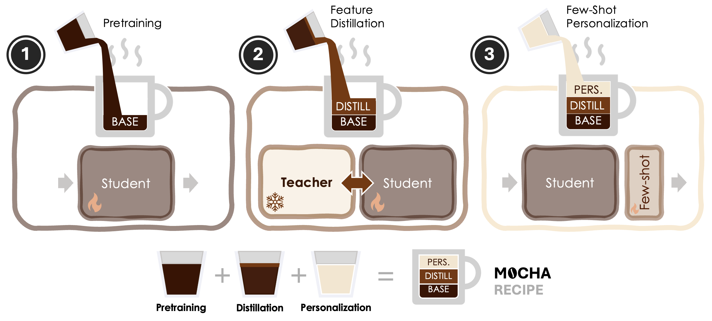

# MOCHA: Multimodal Object-driven Cross-arcHitecture Alignment ☕

Elena Camuffo $^{1,2}$, Francesco Barbato $^{1,2}$, Mete Ozay $^1$, Simone Milani $^2$, Umberto Michieli $^1$

$^1$ Samsung R&D Institute UK, United Kingdom;
$^2$ University of Padova, Italy

[](https://arxiv.org/pdf/2509.14001)


MOCHA recipe. (1) Pretraining student model. (2) Knowledge distillation on rich joint visual and textual features from a frozen teacher. (3) Few-shot personalization with frozen student and prototypical learner.

## Environment Setup 🛠️🐍

1. Create a Python 3.11 environment and install requirements:  
    ```bash
    conda create -n mocha python==3.11.5
    conda activate mocha
    pip install -r requirements.txt
    ```

2. Download the evaluation datasets processed into YOLO format and place them in the `data` directory. If needed, modify the paths in `datasets/data_paths.yaml`. The datasets include:  
      - [CORe50](https://zenodo.org/records/13254883)
      - [iCubWorld](https://zenodo.org/records/13254883)
      - [PerSeg](https://zenodo.org/records/13254883)
      - POD (currently unavailable to the public)  

3. Download the [OpenImages](https://storage.googleapis.com/openimages/web/download_v7.html) in `data/openimages`.
Put the script `OI_subset.py` in `data/openimages/OpenImages` in such a way that the folder structure is the following:  
      ```
      data/openimages/
      ├── OpenImagesRaw/
      │   ├── oidv6-class-descriptions.csv
      │   ├── oidv6-train-annotations-bbox.csv
      │   ├── oidv6-test-annotations-bbox.csv
      │   ├── validation-annotations-bbox.csv
      │   ├── train/
      │   ├── val/
      │   └── test/
      └── OpenImages/
            └── OI_subset.py
      ```

4. Rearrange the folder structure to match the YOLO dataset format (for more details, refer to the [Ultralytics documentation](https://docs.ultralytics.com/datasets/)):
      ```
      data/openimages/
      ├── train/
      │   ├── images/
      │   │   ├── im1.jpg
      │   │   ├── im2.jpg
      │   │   └── ...
      │   ├── labels/
      │   │   ├── im1.txt
      │   │   ├── im2.txt
      │   │   └── ...
      ├── val/
      │   ├── images/
      │   ├── labels/
      └── ...
      ```

## How to make MOCHA ☕️ 🥐

### 1) Getting Started
When running the code for the fist time on the OpenImages dataset using LLaVa or CLIP as teacher the code will generate the appropriate cache files for them.
Note that, to align with previous work, we employ a subset of the OpenImages which can be extracted by running the `OI_subset.py` script.

To compute the Text-Vision embeddings you need to merge them:

```bash
python merge_embeddings_oi.py
```

To initialize the PCA on the OpenImages embeddings merged, and store:

```bash
python intitialize_pca_oi.py
```

If needed you can repeat the previous steps and use the `fs` version to compute the PCA on few-shot datasets.


### 2) Feature Distillation
To train the MOCHA architecture you can run the following command:

```bash
torchrun --nproc_per_node=1 both_pretrain.py --pca_dim 512 --epochs 50
```

By default the code will initialize the YOLOv8 architecture on COCO (`--init_ckpt=none`).
You can set `--init_ckpt=ckpts/auxft.pth` and `--epochs=20` to train the MOCHA (AuXFT) variant.
Please find more details about AuXFT [here](https://github.com/SamsungLabs/AuXFT).

### 3) Few-Shot Personalization

To test baselines:

```bash
python train_protonet.py --model llava-clip --pca_path ckpts/pca_oi.npz --dataset perseg --pca_dim 256
```

To evaluate on MOCHA baselines:

```bash
python train_protonet.py --model mocha --pca_dim 512 --dataset perseg --ckpt "ckpts/mocha.pth"
```

Note that, similarly to AuXFT, before evaluating on the CORe50 and iCubWorld dataset you should generate finetuned checkpoints by running the `finetune_core_icub.py` script.


## Citation 📜✨
If you find this work useful, please cite:

```bibtex
@article{camuffo2025mocha,
    title={MOCHA: Multimodal Few-Shot Learning with Knowledge Distillation},
    author={Camuffo, Elena and Barbato, Francesco and Ozay, Mete and Milani, Simone and Michieli, Umberto},
    journal={arXiv preprint arXiv:2509.14001},
    year={2025}
}
```
