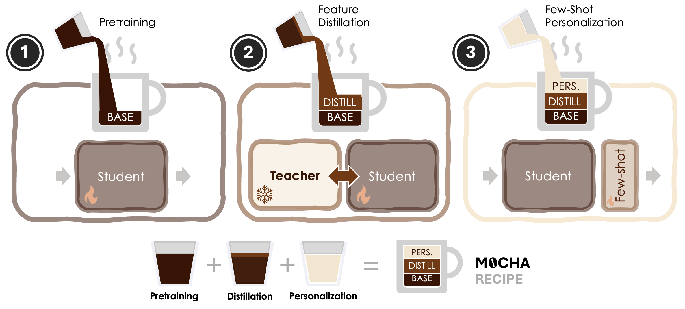

# MOCHA: Multimodal Object-driven Cross-arcHitecture Alignment ☕

Elena Camuffo $^{1,2}$, Francesco Barbato $^{1,2}$, Mete Ozay $^1$, Simone Milani $^2$, Umberto Michieli $^1$

$^1$ Samsung R&D Institute UK, United Kingdom;
$^2$ University of Padova, Italy

[](https://arxiv.org/pdf/2509.14001)


MOCHA recipe. (1) Pretraining student model. (2) Knowledge distillation on rich joint visual and textual features from a frozen teacher. (3) Few-shot personalization with frozen student and prototypical learner.

## Environment Setup 🛠️🐍

1. Create a Python 3.11 environment and install requirements:  
    ```bash
    conda create -n mocha python==3.11.5
    conda activate mocha
    pip install -r requirements.txt
    ```

2. Download the evaluation datasets processed into YOLO format and place them in the `data` directory. If needed, modify the paths in `datasets/data_paths.yaml`. The datasets include:  
      - [CORe50](https://zenodo.org/records/13254883)
      - [iCubWorld](https://zenodo.org/records/13254883)
      - [PerSeg](https://zenodo.org/records/13254883)
      - POD (currently unavailable to the public)  

3. Download the [OpenImages](https://storage.googleapis.com/openimages/web/download_v7.html) in `data/openimages`.
Put the script `OI_subset.py` in `data/openimages/OpenImages` in such a way that the folder structure is the following:  
      ```
      data/openimages/
      ├── OpenImagesRaw/
      │   ├── oidv6-class-descriptions.csv
      │   ├── oidv6-train-annotations-bbox.csv
      │   ├── oidv6-test-annotations-bbox.csv
      │   ├── validation-annotations-bbox.csv
      │   ├── train/
      │   ├── val/
      │   └── test/
      └── OpenImages/
            └── OI_subset.py
      ```

4. Rearrange the folder structure to match the YOLO dataset format (for more details, refer to the [Ultralytics documentation](https://docs.ultralytics.com/datasets/)):
      ```
      data/openimages/
      ├── train/
      │   ├── images/
      │   │   ├── im1.jpg
      │   │   ├── im2.jpg
      │   │   └── ...
      │   ├── labels/
      │   │   ├── im1.txt
      │   │   ├── im2.txt
      │   │   └── ...
      ├── val/
      │   ├── images/
      │   ├── labels/
      └── ...
      ```

## How to make MOCHA ☕️ 🥐

### 1) Getting Started
When running the code for the first time on the OpenImages dataset using LLaVa or CLIP as the teacher model, the necessary cache files will be automatically generated. 
To ensure consistency with prior work, we use a subset of the OpenImages dataset. This subset can be extracted by executing the `OI_subset.py` script.

#### 1b) Compute PCA [Optional]

After caching separately llava and clip features, these can be merged and compressed via PCA, as follows.

To cache the Text-Vision embeddings:

```bash
python caching_oi.py
```

To compute the PCA on the merged OpenImages embeddings:

```bash
python intitialize_pca_oi.py
```

If needed you can repeat the previous steps and use the `fs` version to compute the PCA on few-shot datasets, specifying the dataset.

Note that you can skip this step by downloading the already computed PCA on OpenImages from [here](https://drive.google.com/file/d/1g58jzC1CJu_BrWscCHOqGKrkalAQcrYP/view?usp=share_link) and store it in `ckpts/pca_oi.npz`.
The checkpoints `ckpts/auxft.pth`, `ckpts/base.pth` belong to the original repo of AuXFT [here](https://github.com/SamsungLabs/AuXFT) and can also be downloaded.


### 2) Feature Distillation
To train the MOCHA architecture you can run the following command:

```bash
torchrun --nproc_per_node=1 distillation.py --pca_dim 512 --epochs 50
```

By default the code will initialize the YOLOv8 architecture on COCO (`--init_ckpt=none`).
You can set `--init_ckpt=ckpts/auxft.pth` and `--epochs=20` to train the MOCHA (AuXFT) variant.

### 3) Few-Shot Personalization

To evaluate MOCHA:

```bash
python train_protonet.py --model mocha --pca_dim 512 --pca_path ckpts/pca_oi.npz --dataset perseg --ckpt ckpts/mocha.pth
```

Note that, similarly to AuXFT, before evaluating on the CORe50 and iCubWorld dataset you should generate finetuned checkpoints by running the `finetune_core_icub.py` script.


## Citation 📜✨
If you find this work useful, please cite:

```bibtex
@article{camuffo2025mocha,
    title={MOCHA: Multimodal Few-Shot Learning with Knowledge Distillation},
    author={Camuffo, Elena and Barbato, Francesco and Ozay, Mete and Milani, Simone and Michieli, Umberto},
    journal={arXiv preprint arXiv:2509.14001},
    year={2025}
}
```
